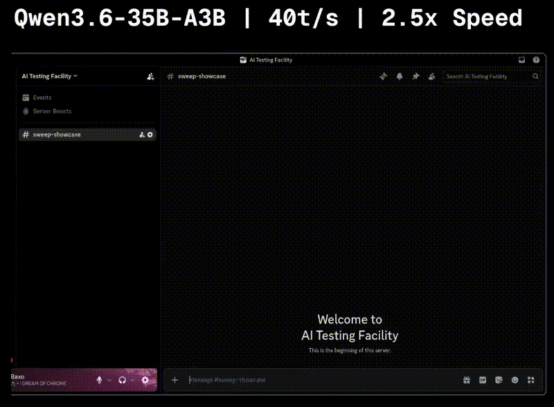
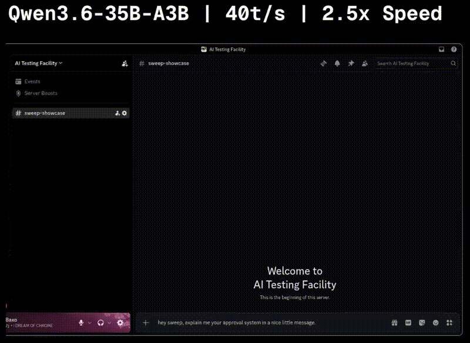

# 🧹 Sweep

**Sweep is not like a traditional Discord bot**. It understands complex requests and is able to act directly with the Discord API using tools. **No hardcoded commands**.



## ✨ Features

- Tool calling to **interact directly with the Discord API**
- A **per-channel context** so messages don't get mixed up
- Uses an **OpenAI-compatible endpoint**, so **both selfhosted and non-selfhosted backends are supported**
- **Versatile use cases**. You are not tied to any hardcoded logic

## 🛡️ Safety

Sweep implements safety measures to prevent unprivileged users from manipulating it into performing unauthorized actions. Note that LLMs can still be tricked.

- **Approval system:** Users must explicitly grant permission via an embed button before Sweep can act on their behalf.
  

## 🌐 OpenAI-Compatible Endpoint

Sweep supports any OpenAI-compatible endpoint. Tools that offer such endpoints are:

- [llama.cpp](https://github.com/ggml-org/llama.cpp)
- [Ollama](https://ollama.com/)
- [LM Studio](https://lmstudio.ai/)
- [vLLM](https://vllm.ai/)
- Many cloud providers

## ⚓ Requirements

Rust requirements:

- **Sweep is always developed on the latest Rust version. Backwards-compatibility is not guaranteed.**

LLM requirements:

- **Tool calling support**
- There is **no explicit requirement for a parameter count**, but be aware that smaller models are more likely to mess up requests. See the [Tested With Section](#-tested-with) for more information.

## ⚡ Quickstart

First, clone the repository:

```bash
git clone https://github.com/nghuy0901/BotAgent.git
```

Then, configure Sweep via your `.env` file (you may also configure the [OpenAI endpoint](#-openai-endpoint-configuration)):

```ini
DISCORD_TOKEN=your_discord_bot_token
MODEL=your_model
```

Lastly, run Sweep:

```bash
cargo run --release
```

## 🔬 Tested With

The repository has a file with tested models and notes to them. [Check it out!](./RATINGS.md)

## ⚙️ Configuration

### 💫 OpenAI Endpoint Configuration

Sweep uses [async-openai](https://github.com/64bit/async-openai) for connecting to the OpenAI-compatible endpoint. You can configure the used endpoint with environment variables. The most important ones are:

- `OPENAI_API_KEY`: Your API key (if needed)
- `OPENAI_BASE_URL`: The base url of the endpoint (default: `https://api.openai.com/v1`)
- [See more environment variables here](https://github.com/64bit/async-openai/tree/main#usage)

### 🧹 Sweep

The binary expects the following environment variables to be present:

- `DISCORD_TOKEN`: The Discord bot token for logging into the Discord user
- `MODEL`: The model that is used for inference

You may use a `.env` file.

## 🗺️ Roadmap

You can check existing feature requests [here](https://github.com/nghuy0901/BotAgent/issues?q=is%3Aissue%20state%3Aopen%20label%3Aenhancement). You can also submit new feature requests.

## 💣 Common Errors

- `Unexpected Endpoint`: Make sure that the OPENAI_BASE_URL does not have a trailing `/`

## 🤝 Contributing

Pull requests and issues are very welcome! This applies to bug fixes, bug reports, feature requests and basically everything!

## 📄 License

This project is licensed under the **AGPL-3.0**. This means that if you modify Sweep and run it as a service, you must publish your modifications under the same license.

See [LICENSE](./LICENSE) for details.
